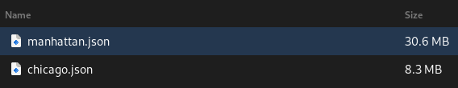

<h1>city-viewer</h1>

<h2>Instructions</h2>

    <ol>
        <li>
            Click choose file on the menu on the top left of the window.
             
            
        </li>
        <li>
            Select a json file from the folder named 'json'.
             
            
        </li>
        <li>
            Use the menu options or click and drag the screen to view the buildings.
        </li>
    </ol>

